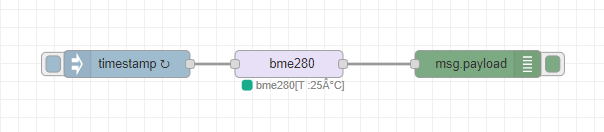
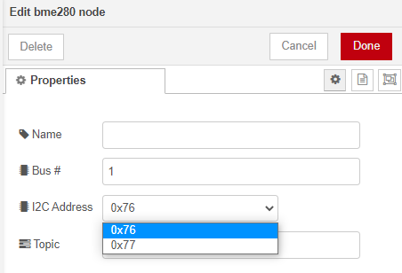
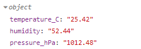

# node-red-contrib-bme280-lb

This is a node-red wrapper for the bme280. It uses I2C as communicating protocol. Hardware know-how is assumed.

## Installation

This is not an official node.js module hence it will need to be installed from github.

1. Navigate to the node-red root directory ```cd ~/.node-red``` on your linux platform
2. Install the module ```npm install luqmaanb/node-red-contrib-bme280-lb```
3. Stop node-red ```node-red-stop```
4. Start node-red ```node-red-start```

## Example Flow

```json
[{
	"id": "da2d366f.a12ba8",
	"type": "tab",
	"label": "Flow 5",
	"disabled": false,
	"info": ""
}, {
	"id": "a3143510.b32548",
	"type": "bme280",
	"z": "da2d366f.a12ba8",
	"name": "",
	"bus": "1",
	"address": "0x76",
	"topic": "bme280",
	"x": 520,
	"y": 340,
	"wires": [
		["6f3f007b.02edb"]
	]
}, {
	"id": "6f3f007b.02edb",
	"type": "debug",
	"z": "da2d366f.a12ba8",
	"name": "",
	"active": true,
	"tosidebar": true,
	"console": false,
	"tostatus": false,
	"complete": "false",
	"statusVal": "",
	"statusType": "auto",
	"x": 730,
	"y": 340,
	"wires": []
}, {
	"id": "4e33cf3d.7edb7",
	"type": "inject",
	"z": "da2d366f.a12ba8",
	"name": "",
	"props": [{
		"p": "payload"
	}, {
		"p": "topic",
		"vt": "str"
	}],
	"repeat": "1",
	"crontab": "",
	"once": false,
	"onceDelay": 0.1,
	"topic": "",
	"payload": "",
	"payloadType": "date",
	"x": 340,
	"y": 340,
	"wires": [
		["a3143510.b32548"]
	]
}]
```

## Usage

1. Import the flow above into node-red

2. Screenshot of nodes



3. Select the I2C address from the drop down menu. Raspberry Pi uses bus 1.



4. Flow output



